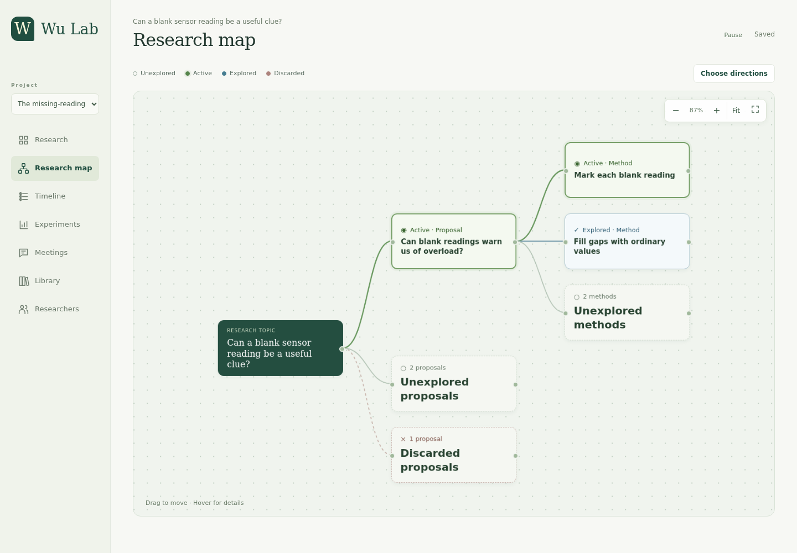
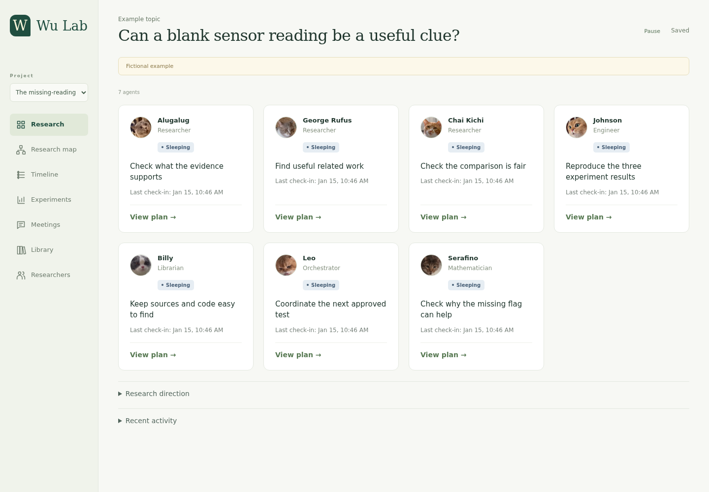
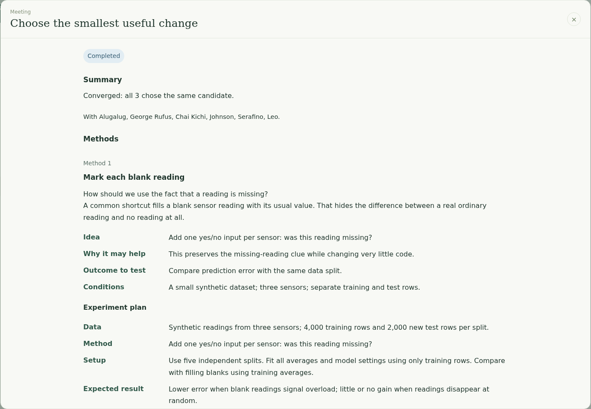
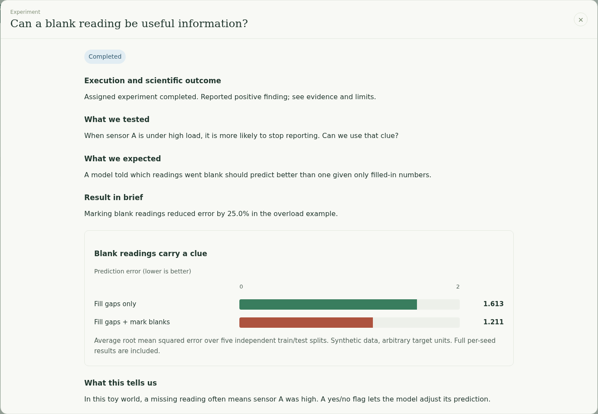
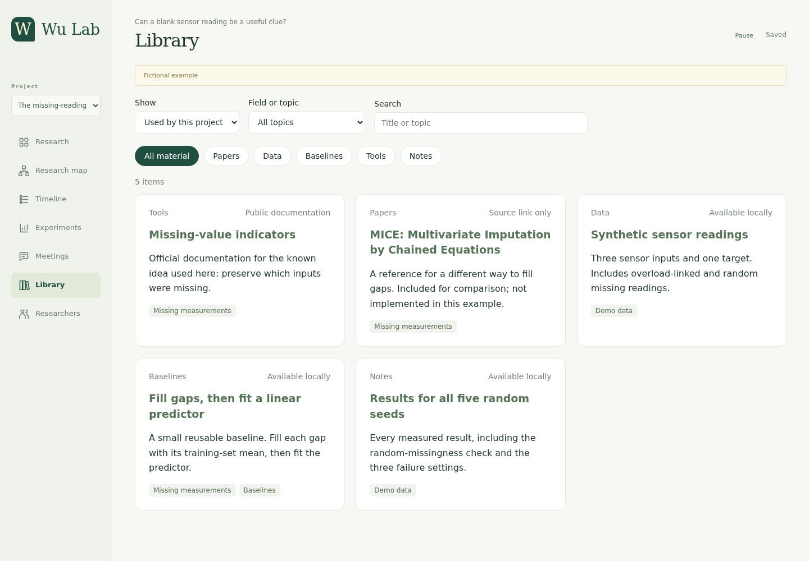
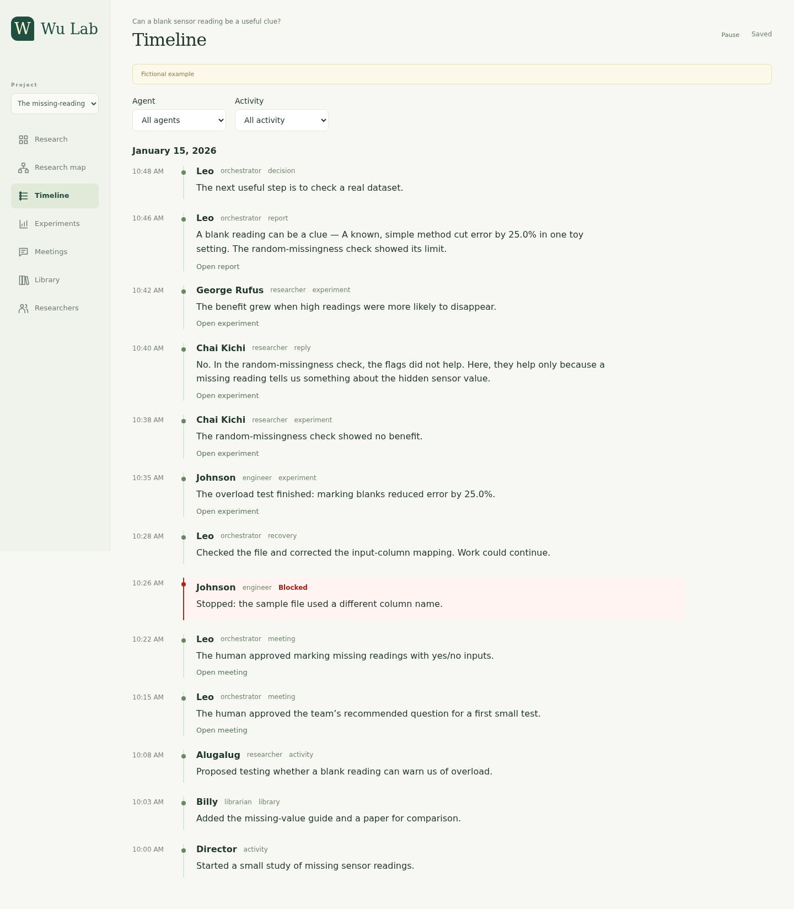
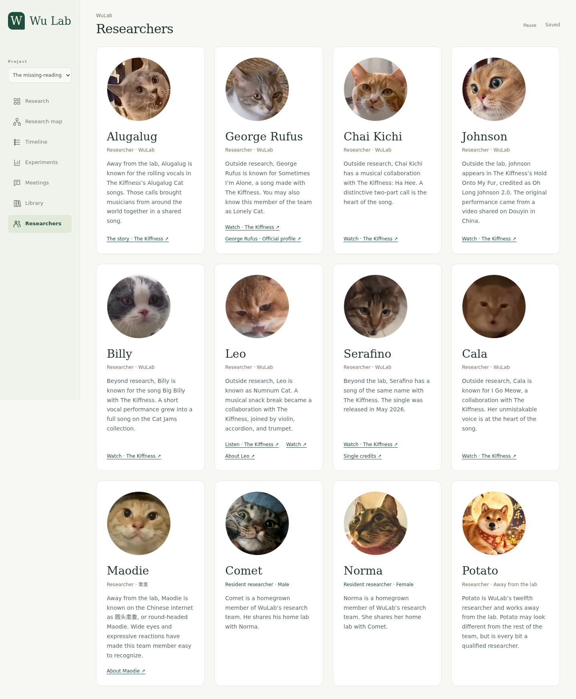

# Autonomous AI Lab

This project is mainly a **template for your own AI research lab**. Ask your own AI agent to read this repository and customize the workflow, agent roles, dashboard, and tools to fit your research.

**A team of AI researchers, with a human expert in the loop.**

Give the lab a research area. Researchers read related work and propose useful questions. They discuss and vote; **you decide what happens next**. The team then designs experiments, tests an approved method, and checks what the results mean.

Follow the study in one dashboard: ideas, meetings, experiments, sources, questions, and progress. This framework grew out of **WuLab**.



## Try it in a minute

Install **Node.js 24+** with npm and **Python 3.10+** available as `python3`. From this repository:

```sh
git clone https://github.com/ChunshuWu/autonomous-AI-lab.git
cd autonomous-AI-lab
npm run demo
```

Open **http://127.0.0.1:8768**. In VS Code on a remote server, forward port **8768** in the Ports panel. No AI account, model calls, or npm dependencies are needed for the demo.

The example asks: **Can a blank sensor reading be a useful clue?** Imagine a sensor that stops reporting when it gets too hot. Filling its blank reading with an average hides that warning. The example tests whether also marking the reading as missing helps a prediction model.

**The team activity is scripted; the synthetic experiment is real and rerunnable.** It illustrates a known method, not a new discovery. The demo is read-only. [Read the experiment and its limits](examples/missing-measurements/README.md).

## See the work, not just the final answer

### A team you can follow

See each agent’s role, current task, status, and plan. Waiting agents make no model calls. The cat and dog researchers keep the dashboard personal and easy to recognize.



### Clear meetings, with you making the decision

Researchers prepare independently, discuss once, and vote. The engineer and mathematician join the discussion. Ask an individual researcher about a proposal or method, choose the next step, or reject the candidates and send the team back to reading. Everyone receives your decision and the meeting conversations before continuing.



### Experiments you can understand

Each method describes the data, the change to test, the setup, the expected result, and what it would teach us. Results include figures, comparisons, limits, and saved evidence.



<details>
<summary>More example pages: library, timeline, and researcher profiles</summary>

The shared library tracks papers, datasets, code, and reusable baselines. A saved link and a paper that was actually read are different records.



The timeline records progress, decisions, and blocks. Blocked events appear in red, followed by repair attempts and their outcome.





</details>

## How research works

1. **Proposal:** Find a narrow, useful question that the available data and compute can address. Check whether prior work already answers it. Discuss, vote, and wait for the human’s decision.
2. **Research:** Suggest concrete experiments for the same selected idea. Discuss, vote, and get the human’s decision. The engineer tests the approved method; the mathematician handles needed arguments. Researchers examine the evidence and suggest the next step.

The **orchestrator** coordinates work and tries to fix operational blocks. The **librarian** tracks sources and reusable files. Researchers review one another’s work. Rejected ideas stay in the record so the team can avoid repeating them.

Five editable models define the behavior: [research](skill/wulab-research/research.md), [communication](skill/wulab-research/communication.md), [library](skill/wulab-research/library.md), [human interaction](skill/wulab-research/human-interface.md), and [scheduling](skill/wulab-research/scheduling.md).

## Start your own project

```sh
npm start
```

Open **http://127.0.0.1:8767** for an empty, persistent lab. Follow the [setup guide](docs/setup.md) to connect workers, write a brief, and create a team. The current adapter uses Codex CLI and your own account. Model availability and permissions depend on your installation; other providers need an adapter.

The server and workers are separate processes. **Starting the dashboard alone does not start paid research.** Actual research can use paid model calls; calls and tokens appear as counters. The local server is for one trusted user and binds to your computer’s loopback address.

## Develop

```sh
npm test
npm run test:local
```

The dashboard uses plain JavaScript, the local server uses Node’s built-in SQLite, and the dispatcher uses Python. See [architecture](docs/architecture.md) and [screenshot instructions](docs/screenshots.md).

This folder is both the working lab and the source repository. `.gitignore` keeps private projects, papers, data, credentials, and service state local. New installs start empty. The sample project is included; private research is not.

This is an early research framework. Software tests check the workflow and local setup; they do not establish research quality or validate paid model access on your account.

## License

Original code, documents, and example data use the [MIT License](LICENSE). Profile photos and third-party components retain their own terms; see [third-party notices](THIRD_PARTY_NOTICES.md).
