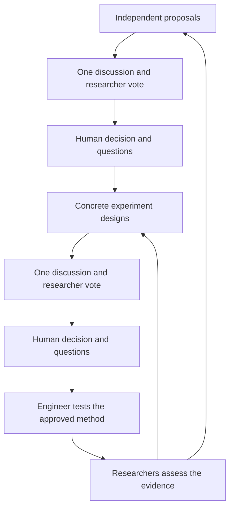

# How the pieces fit

The engineer and mathematician join both meetings. Researchers vote; the human decides. The human can select a candidate, reject all and request more reading, or stop. Before approved work starts, the team reads the decision and meeting conversations. Rejected ideas and their reasons remain available to future tasks.

The orchestrator is an agent. The workflow controller is code that checks dependencies, work permission, results, and delivery. The Python dispatcher runs scoped model calls or bookkeeping jobs. Sleeping agents make no model calls; ready agents can work in parallel.

| Location | Contents |
| --- | --- |
| `skill/wulab-research/` | Five models and skill entry point |
| `site/` | Dashboard, API, records, controller, tests |
| `runtime/task-service/` | Dispatcher, task contracts, delivery checks |
| `runtime/library/` | Optional paper importer and search |
| `scripts/` | Server, setup, project creation, tests, screenshots |
| `examples/missing-measurements/` | Reproducible experiment and scripted demo |
| `config/` | Templates for a new installation |
| `.wulab/` | Local database, tokens, settings and state; ignored by Git |
| `projects/ID/workspace/` | Private briefs, outputs and evidence; ignored |
| `library/`, `data/`, `lab/` | Private sources, data and local instructions; ignored |

Workers save result files and confirm dashboard delivery before dependent tasks continue. The library distinguishes links, local holdings, and material actually read. Operational blocks get a recovery case and a red timeline entry. The orchestrator tries permitted repairs; human holds remain binding.

The Node server adapts the Worker API to SQLite. It rejects cross-origin requests and uses tokens for worker requests and browser writes. It is intended for one trusted local user; public hosting needs separate authentication and access controls. The demo is read-only and cannot launch model calls.

Builds include no local project or library seeds by default. `WULAB_LOCAL_SEEDS=1` is a local maintenance option for explicitly importing ignored legacy seed files. Do not publish that build.
